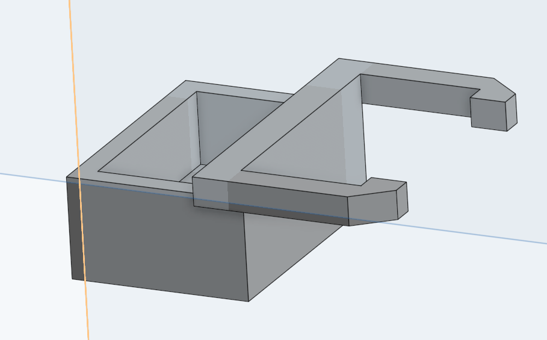
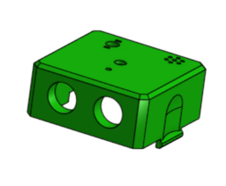
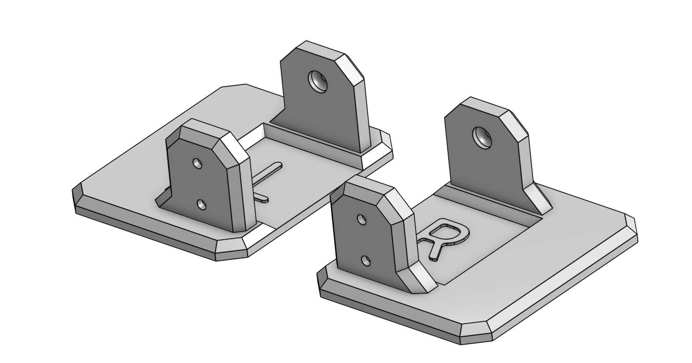
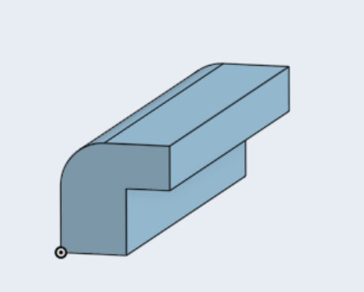

# Conception et prototypage

## Lestage

Nous avons decidé de lester le robot pour differente épreuve. Nous avons donc pensé à faire des sacs de leste.

## Tête

Nous avons modifié la hauteur pour qu'il soit plus léger, éviter les coups plus facilement durant le sumo.

## Pieds

Nous avons agrandi la taille des pieds pour qu'il tienne plus en équilibre

## Rails

Nous avons créé des rails pour pouvoir mettre des chapeaux sur la tête

