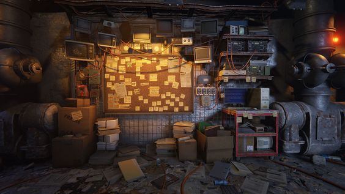
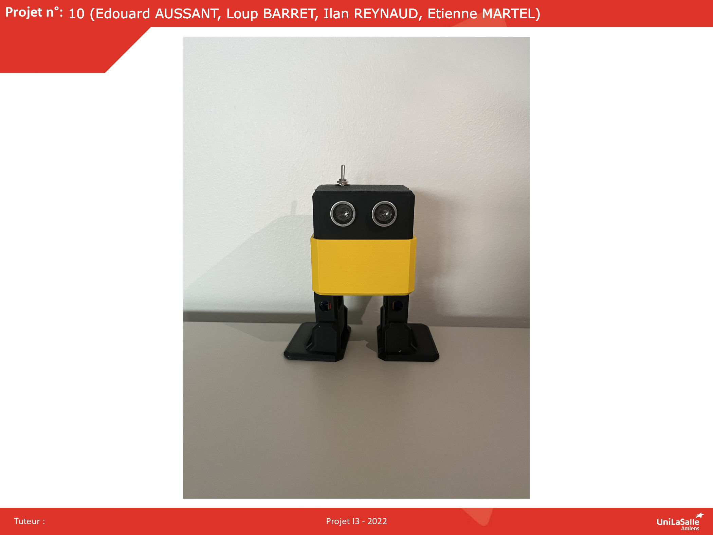

# Bienvenue sur notre documentation

Bienvenue dans la documentation du projet Otto du groupe 10. Ce site a pour but de fournir toutes les informations nécessaires pour comprendre, utiliser et reproduire efficacement notre projet.

## À propos du Projet

Décrivez ici en quelques lignes l'objectif et l'aperçu général de votre projet. Quel est son but ? À qui est-il destiné ? Quels problèmes cherche-t-il à résoudre ?
Notre projet consiste à construire et comprendre la fabrication d’OTTO afin de pourvoir modifier ça conception et de créer un OTTO personnelle répondant à des critères commun. Le but de ce robot est de parcourir plusieurs épreuves (chrono challenge, course d’obstacle, sumo, tir à la corde).

## Poster

Ici vous publierez le poster de votre projet.

---
